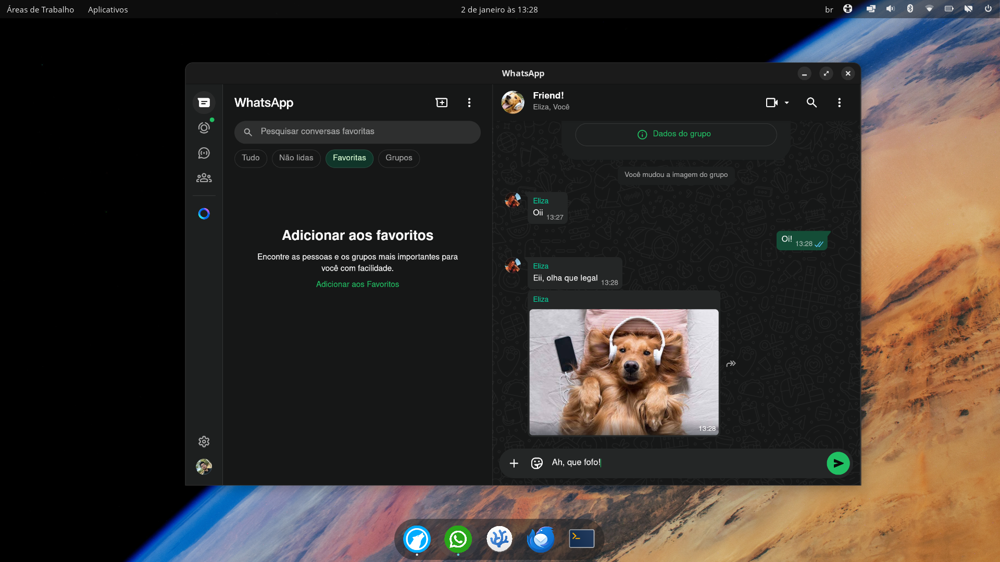

# Python WhatsApp GTK
> Implementação nativa e otimizada do WhatsApp Web para Linux via WebKit.



## Sobre o Projeto
Sempre prezei pelo equilíbrio entre **privacidade, eficiência e conforto**. 

Embora as soluções baseadas em PWA (Chrome/Edge) e wrappers em Electron sejam funcionais, elas frequentemente introduzem um overhead significativo de recursos e camadas de coleta de dados do próprio navegador. A proposta aqui é desacoplar o WhatsApp de navegadores generalistas, criando uma instância dedicada e transparente.

Fiz um **wrapper** em **Python** — linguagem com a qual tenho familiaridade — utilizando o **WebKit2**, que gera um ambiente isolado e sem telemetria por parte dos navegadores.

**Nota sobre Privacidade:** O objetivo deste wrapper é mitigar a telemetria de terceiros (o rastreamento do navegador/browser). É importante ressaltar que, ao utilizar o WhatsApp Web, a interação e os dados trocados continuam sujeitos aos termos de uso e coleta de dados da Meta Platforms, Inc.

> *"Recomendo a todos que criem vocês mesmos seus programas desse tipo. Caso não queiram, aí está o meu: transparente e auditável."*

## Funcionalidades
- **Eficiência Máxima:** Motor WebKit2 otimizado para baixo consumo de RAM.
- **Isolamento de Dados:** Sessão e cache isolados (padrão XDG).
- **Notificações Nativas:** Suporte completo a notificações do sistema (via libnotify).
- **Aceleração de Hardware:** Renderização via GPU para maior fluidez.
- **Robustez:** Tratamento de erros de conexão com tentativa automática de reconexão.
- Instalação integrada ao menu do sistema.
- Suporte a gestos (padrão WebKit).

## Pré-requisitos
Para instalar o wrapper, você precisa do Git, Python 3 e das bibliotecas do sistema do GTK, WebKit e notificações. Escolha o comando de acordo com sua distribuição:

### Debian / Ubuntu / Pop!_OS
```bash
sudo apt update
sudo apt install -y git python3 python3-gi python3-gi-cairo gir1.2-gtk-3.0 gir1.2-webkit2-4.1 gir1.2-notify-0.7 libnotify-bin
```

### Fedora / Red Hat / CentOS
```bash
sudo dnf install git python3 python3-gobject python3-cairo gtk3 webkit2gtk4.1 libnotify
```

### Arch Linux / Manjaro / EndeavourOS
```bash
sudo pacman -S git python python-gobject python-cairo gtk3 webkit2gtk-4.1 libnotify
```

### Slackware
```bash
sudo slackpkg update
sudo slackpkg install git python3 pygobject3 pycairo gtk+3 webkit2gtk libnotify
```
### Dicionário
| **Componente** | **Debian/Ubuntu** | **Fedora** | **Arch Linux** | **Slackware** 
| :---: | :---: | :---: | :---: | :---:
| **GIT** | git | git | git | git
| **Linguagem** | python3 | python3 | python | python3
| **Bindings GObject** | python3-gi | python3-gobject | python-gobject | pygobject3
| **Bindings Cairo** | python3-gi-cairo | python3-cairo | python-cairo | pycairo
| **GTK 3** | gir1.2-gtk-3.0 | gtk3 | gtk3 | gtk+3
| **WebKit 4.1** | gir1.2-webkit2-4.1 | webkit2gtk4.1 | webkit2gtk4.1 | webkit2gtk
| **Notificações** | gir1.2-notify-0.7 libnotify-bin | libnotify | libnotify | libnotify
## Instalação e uso
### 1. Clone o repositório:
```bash
git clone https://github.com/lourivaldantas/python-whatsapp-gtk.git
cd python-whatsapp-gtk
```

### 2. Execute o instalador
```bash
chmod +x install.sh
./install.sh
```

## Desinstalação do programa
Para remover completamente a aplicação e seus resíduos de dados:
```bash
# Remove o executável e o atalho
rm ~/.local/bin/python-whatsapp-gtk
rm ~/.local/share/applications/python-whatsapp-gtk.desktop
# Remove os dados de navegação (Login, Cache, Cookies)
rm -rf ~/.local/share/python-whatsapp-gtk
```

## Arquitetura
Diferente de aplicações construídas sobre o framework Electron — que empacotam uma instância completa do Chromium para cada aplicação — este projeto adota uma abordagem de reuso de bibliotecas do sistema.

A arquitetura opera em três camadas distintas:

1. **Backend (Python 3)**: Orquestra a lógica da aplicação, gerenciamento de janelas, travas de processo único (file locks) e tratamento de sinais do sistema.

2. **Camada de Abstração (PyGObject):** Realiza os bindings via Introspecção GObject, permitindo que o código Python manipule diretamente as bibliotecas C/C++ do ecossistema GNOME sem penalidade de performance.

**Engine (WebKit2):** Responsável pela renderização web, operando com perfil de dados exclusivo definido em ~/.local/share/python-whatsapp-gtk.


### O Diferencial:
**Isolamento de Dados:** O script força o WebKit a criar um contexto de dados ("perfil") exclusivo dentro da pasta ~/.local/share/python-whatsapp-gtk. Isso garante que:
- Seus cookies do WhatsApp não se misturam com seu navegador principal.
- Você tem portabilidade total (basta copiar a pasta para fazer backup da sessão).
**Otimização de Recursos:** Além do isolamento, o código desativa recursos desnecessários do WebKit2 (como corretor ortográfico e ferramentas de desenvolvedor) e força o uso da GPU, garantindo que o WhatsApp Web utilize o mínimo de recursos possível.

## Performance

Um dos focos deste projeto é eficiência. Em meus testes pessoais comparativos realizados em janeiro de 2026, o **Python WhatsApp GTK** se mostrou o mais leve para rodar o WhatsApp no Linux, consumindo significativamente menos RAM que
navegadores tradicionais.

Os testes foram realizados em um ambiente limpo, medindo o consumo médio de RAM (em MB) após o carregamento e scroll padronizado de um grupo com histórico de mensagens.


| Cliente / Navegador | Consumo Médio de RAM | Diferença |
| :--- | :---: | :--- |
| **Python WhatsApp GTK** | **1.469 MB** | **(Referência)** |
| Google Chrome | 1.668 MB | +13.5% |
| ZapZap (QtWebEngine) | 1.715 MB | +16.7% |
| Firefox (Padrão) | 2.129 MB | +44.9% |
| Firefox (+Extensões) | 2.435 MB | +65.7% |

> **Conclusão:** O wrapper economiza cerca de **200 MB** em comparação ao Google Chrome, e quase **1 GB** (966 MB) em comparação a um Firefox com extensões de uso diário.

Obs.: O *ZapZap* foi usado como parâmetro justamente por ser a referência em excelência e qualidade. Meu programa não se propõe a ser melhor que o ZapZap.

## Licença
Este projeto é desenvolvido sob a Licença Pública Geral GNU v3.0 (GPLv3).

Isso significa que você tem a liberdade de:

- Usar o software para qualquer finalidade.
- Estudar como o programa funciona e adaptá-lo às suas necessidades.
- Redistribuir cópias de modo que você possa ajudar ao seu próximo.
- Aperfeiçoar o programa e liberar os seus aperfeiçoamentos, de modo que toda a comunidade se beneficie.

Consulte o arquivo [LICENSE](LICENSE) para mais detalhes.
