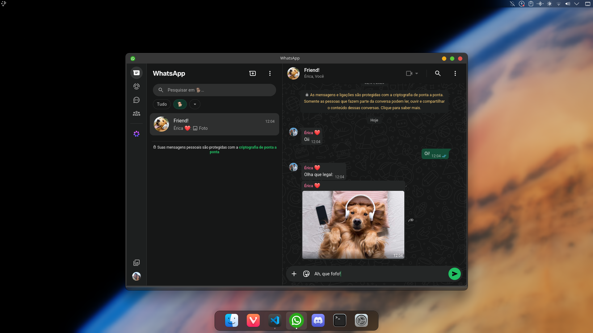
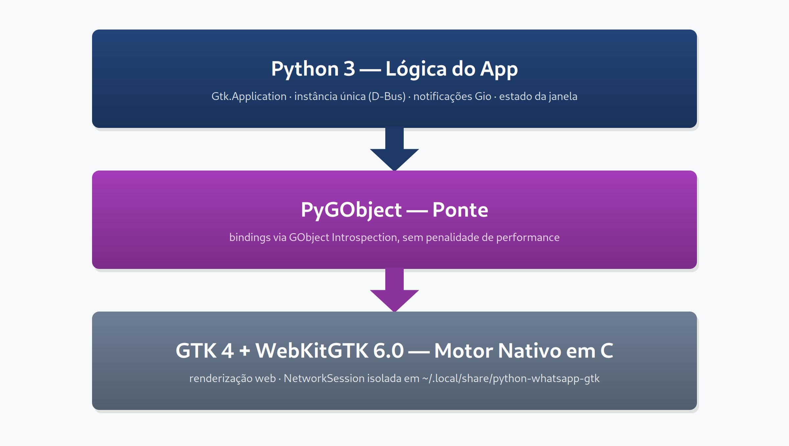
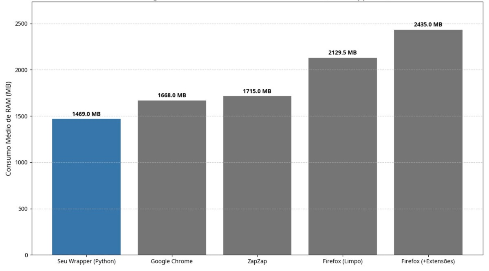

<div align="center">

<h1>Python WhatsApp GTK</h1>

</br>


**Implementação integrada e otimizada do WhatsApp Web para Linux via GTK 4 + WebKitGTK 6.0.**



</div>

## Sobre o Projeto

> **Novidade (v2.0):** o aplicativo foi completamente reescrito sobre **GTK 4** e **WebKitGTK 6.0**, corrigindo as instabilidades da série 1.x e modernizando toda a integração com o desktop (notificações nativas, modo escuro via portal XDG, instância única via D-Bus e recuperação automática de falhas).

Sempre prezei pelo equilíbrio entre **privacidade, eficiência e conforto**.

Embora soluções PWA (Chrome/Edge) e Electron sejam funcionais, elas frequentemente trazem o peso de um navegador completo. Este projeto desacopla o WhatsApp de navegadores generalistas, criando uma instância dedicada, leve e transparente.

Fiz um **wrapper** em **Python** — linguagem com a qual tenho familiaridade — utilizando o **WebKitGTK**, que gera um ambiente isolado e sem telemetria por parte dos navegadores.

**Nota sobre Privacidade:** O objetivo deste wrapper é mitigar a telemetria de terceiros (o rastreamento do navegador/browser). É importante ressaltar que, ao utilizar o WhatsApp Web, a interação e os dados trocados continuam sujeitos aos termos de uso e coleta de dados da Meta Platforms, Inc.

## Funcionalidades Principais

- 🚀 **Eficiência Máxima:** Motor WebKitGTK 6.0 otimizado para baixo consumo de RAM.
- 🔒 **Isolamento de Dados:** Sessão, cookies e cache isolados (sem misturar com seu Chrome/Firefox).
- 🔔 **Notificações Nativas:** Integração direta com o sistema via Gio/D-Bus — sem dependências extras; clicar na notificação traz a janela de volta.
- 📥 **Gerenciador de Downloads:** Salve PDFs, imagens e documentos onde quiser, com atalho "Abrir pasta" na notificação de conclusão.
- 📎 **Arrastar e Soltar:** Arraste arquivos do gerenciador para a janela (com uma conversa aberta) para anexá-los — uma sobreposição indica a área de soltura.
- 🌗 **Modo Escuro Automático:** Segue a preferência do desktop em tempo real (portal XDG — GNOME, KDE e outros).
- ⚡ **Aceleração de Hardware:** Renderização via GPU.
- 🔁 **Recuperação Automática:** Reconexão automática em falha de rede e recarregamento em caso de queda do processo de renderização.
- 🪟 **Instância Única:** Abrir o app novamente apenas apresenta a janela existente (via D-Bus, sem file locks).
- 🕶️ **Segundo Plano:** Fechar a janela mantém o app rodando e as notificações chegando; reabra pelo launcher ou clicando numa notificação. Alterne com `Ctrl+B`.
- 🔍 **Zoom e Atalhos:** `Ctrl` `+`/`-`/`0` para zoom (persistente), `F5`/`Ctrl+R` recarrega, `F11` tela cheia, `Ctrl+B` alterna segundo plano, `Ctrl+Q` sai.

## Pré-requisitos
Para instalar o wrapper, você precisa do Git, Python 3 e das bibliotecas do sistema do GTK 4 e do WebKitGTK 6.0.

### Debian / Ubuntu
```bash
sudo apt update
sudo apt install -y git python3 python3-gi gir1.2-gtk-4.0 gir1.2-webkit-6.0
```

**Fedora / Red Hat**
```bash
sudo dnf install git python3 python3-gobject gtk4 webkitgtk6.0
```

**Arch Linux / Manjaro**
```bash
sudo pacman -S git python python-gobject gtk4 webkitgtk-6.0
```

### Dicionário de Pacotes
Referência cruzada das dependências por distribuição:

| **Componente** | **Debian/Ubuntu** | **Fedora** | **Arch Linux** |
| :--- | :--- | :--- | :--- |
| **GIT** | `git` | `git` | `git` |
| **Linguagem** | `python3` | `python3` | `python` |
| **GObject** | `python3-gi` | `python3-gobject` | `python-gobject` |
| **GTK 4** | `gir1.2-gtk-4.0` | `gtk4` | `gtk4` |
| **WebKitGTK 6.0** | `gir1.2-webkit-6.0` | `webkitgtk6.0` | `webkitgtk-6.0` |

> **Slackware:** o WebKitGTK 6.0 (variante GTK 4) pode não estar no repositório oficial da sua versão; verifique o [SlackBuilds.org](https://slackbuilds.org) ou o Slackware `-current`.

## Instalação e uso
### 1. Clone o repositório:
```bash
git clone https://github.com/lourivaldantas/python-whatsapp-gtk.git
cd python-whatsapp-gtk
```

### 2. Execute o instalador
```bash
chmod +x install.sh
./install.sh
```

**Pronto!** O ícone do WhatsApp aparecerá no seu menu de aplicativos.

Para rodar direto do repositório (sem instalar):
```bash
python3 run.py
```

---

## Configuração Avançada

### User Agent Automático
O aplicativo se apresenta como um Chrome atual no Linux e **descobre a versão do Chrome automaticamente** pela API oficial VersionHistory do Google — uma requisição leve e sem cookies, feita no máximo uma vez por semana, com cache local e fallback offline. Você nunca mais precisa atualizar o User-Agent na mão.

Configurações antigas com User-Agent fixo padrão são migradas automaticamente para o modo `"auto"`.

Se ainda assim quiser fixar um User-Agent (o que também **desativa** a consulta de rede), edite `~/.local/share/python-whatsapp-gtk/config.json`:

```json
{
    "user_agent": "Mozilla/5.0 (X11; Linux x86_64) AppleWebKit/537.36 (KHTML, like Gecko) Chrome/150.0.0.0 Safari/537.36"
}
```

### Anti-detecção de "Safari"
O WhatsApp Web detecta o motor WebKit por JavaScript e por isso exibia avisos como *"Baixe o WhatsApp para Mac"* mesmo com User-Agent de Chrome. Os vetores de detecção eram vários: `navigator.vendor`, ausência de `navigator.userAgentData`, os *site-specific quirks* do WebKitGTK (que reportam `navigator.appVersion` como Safari de Mac por baixo do UA customizado) e o renderizador WebGL exposto como `"Apple GPU"`. O aplicativo desativa os quirks e injeta, antes de qualquer script da página, uma camada de compatibilidade que se apresenta como Chromium no Linux em todos esses pontos — eliminando o problema na raiz, sem depender de seletores CSS que quebram a cada mudança de layout da Meta.

### Arrastar e soltar arquivos
Arraste arquivos do seu gerenciador de arquivos para a janela para anexá-los à **conversa aberta** — uma sobreposição "Solte para anexar" aparece enquanto você arrasta. O anexo abre no preview normal do WhatsApp (nada é enviado sem você clicar em enviar), e cada tipo é roteado pelo fluxo correto: imagens e vídeos como mídia, PDFs e outros arquivos como documento — inclusive em drops mistos com vários arquivos de uma vez.

Nos bastidores: o drag and drop nativo do WebKitGTK entrega o drop à página, mas com `dataTransfer.files` vazio (o arquivo chega apenas como `text/uri-list`), então o WhatsApp não recebe o arquivo por esse caminho. Acionar o menu de anexo com cliques sintéticos também se mostrou não confiável. A solução: o app intercepta o drop no nível da janela (GTK), lê os arquivos do disco e os entrega ao campo de mensagem como um **evento `paste` sintético com objetos `File` reais** — o mesmo caminho de colar um arquivo do clipboard, que o WhatsApp já trata nativamente. O sucesso é confirmado observando o preview de anexo abrir; um aviso na tela informa o resultado (ex.: "Abra uma conversa para anexar").

Limite: por esse caminho o conteúdo dos arquivos passa pela página em base64, então drops ficam limitados a **64 MiB por arrasto**; para arquivos maiores, use o botão **+** do próprio WhatsApp, que lê direto do disco.

### Segundo plano
Por padrão, fechar a janela **não encerra o aplicativo**: ele continua rodando sem janela, com o WhatsApp Web ativo e as notificações nativas chegando normalmente. Para trazer a janela de volta, clique numa notificação ou abra o app de novo pelo menu (instância única: a mesma janela reaparece). `Ctrl+Q` encerra de verdade.

Para alternar o comportamento, use `Ctrl+B` (uma notificação confirma a mudança) ou edite `"background_mode": true/false` no `config.json`. A preferência é persistente.

> **Nota:** as notificações nativas exibem o nome e o ícone do app corretamente apenas com o atalho instalado (`./install.sh`); rodando só com `python3 run.py` sem o `.desktop` instalado, elas aparecem com atribuição genérica.

### Notificações sem banner recorrente
O WebKitGTK não persiste a permissão de notificações entre sessões, então `Notification.permission` voltava a `"default"` a cada início e o WhatsApp exibia o banner *"As notificações de mensagens estão desativadas"* toda vez. O aplicativo pré-concede a permissão para `web.whatsapp.com` na inicialização do WebContext (`initialize-notification-permissions`), e as notificações são entregues como notificações nativas do GNOME.

---

## Solução de Problemas (Troubleshooting)

**Erro "ModuleNotFoundError: No module named 'gi'"**
- Faltam os bindings GObject para Python (`python3-gi` ou `python3-gobject`).

**Erro "Namespace WebKit not available" (ou Gtk 4.0)**
- Falta o WebKitGTK 6.0 (variante GTK 4) ou o GTK 4. Veja a tabela de pacotes acima — atenção: o pacote `webkit2gtk-4.1` (GTK 3) **não** serve para a versão 2.0.

**O app fecha imediatamente**
- Rode via terminal: `python3 -m whatsapp` para ver o erro (os logs também ficam em `~/.local/share/python-whatsapp-gtk/application.log`).

**As notificações não aparecem**
- As notificações nativas exigem o atalho `.desktop` criado pelo instalador. Rode `./install.sh` e abra o app pelo menu de aplicativos.

---

## Desinstalação do programa
Para remover completamente a aplicação e seus resíduos de dados:
```bash
# Remove o executável, o atalho e o ícone
rm ~/.local/bin/python-whatsapp-gtk
rm ~/.local/share/applications/io.github.lourivaldantas.whatsapp.desktop
rm ~/.local/share/icons/hicolor/256x256/apps/io.github.lourivaldantas.whatsapp.png
# Remove os dados de navegação (Login, Cache, Cookies)
rm -rf ~/.local/share/python-whatsapp-gtk
```

## Arquitetura
Diferente de aplicações construídas sobre o framework Electron — que empacotam uma instância completa do Chromium para cada aplicação — este projeto adota uma abordagem de reuso de bibliotecas do sistema.

A arquitetura opera em três camadas distintas:

1. **Backend (Python 3):** Orquestra a lógica da aplicação via `Gtk.Application` — instância única por D-Bus, ações e atalhos globais, notificações Gio, persistência de estado da janela e tratamento de sinais do sistema.

2. **Camada de Abstração (PyGObject):** Realiza os bindings via Introspecção GObject, permitindo que o código Python manipule diretamente as bibliotecas C/C++ do ecossistema GNOME sem penalidade de performance.

3. **Engine (WebKitGTK 6.0):** Responsável pela renderização web, operando com uma `NetworkSession` de dados exclusiva definida em `~/.local/share/python-whatsapp-gtk`.



### O Diferencial:
**Isolamento de Dados:** O aplicativo cria uma sessão de rede ("perfil") exclusiva dentro da pasta `~/.local/share/python-whatsapp-gtk`. Isso garante que:
- Seus cookies do WhatsApp não se misturam com seu navegador principal.
- Você tem portabilidade total (basta copiar a pasta para fazer backup da sessão).

**Otimização de Recursos:** Além do isolamento, o código desativa recursos desnecessários do WebKit (corretor ortográfico, ferramentas de desenvolvedor, rastreamento inteligente) e força o uso da GPU, garantindo que o WhatsApp Web utilize o mínimo de recursos possível.

**Integração com o Desktop:** O modo escuro acompanha a preferência do sistema em tempo real através do portal XDG (`org.freedesktop.appearance`), o mecanismo padrão usado pelos aplicativos GNOME/KDE modernos — sem hacks de JavaScript injetado.

## Performance

Um dos focos deste projeto é eficiência. Em meus testes pessoais comparativos realizados em janeiro de 2026 (com a versão 1.x), o **Python WhatsApp GTK** se mostrou o mais leve para rodar o WhatsApp no Linux, consumindo significativamente menos RAM que navegadores tradicionais.

Os testes foram realizados em um ambiente limpo, medindo o consumo médio de RAM (em MB) após o carregamento e scroll padronizado de um grupo com histórico de mensagens.



| Cliente / Navegador | Consumo Médio de RAM | Diferença |
| :--- | :---: | :--- |
| **Python WhatsApp GTK** | **1.469 MB** | **(Referência)** |
| Google Chrome | 1.668 MB | +13.5% |
| ZapZap (QtWebEngine) | 1.715 MB | +16.7% |
| Firefox (Padrão) | 2.129 MB | +44.9% |
| Firefox (+Extensões) | 2.435 MB | +65.7% |

> **Conclusão:** O wrapper economiza cerca de **200 MB** em comparação ao Google Chrome, e quase **1 GB** (966 MB) em comparação a um Firefox com extensões de uso diário.

Obs.: O *ZapZap* foi usado como parâmetro justamente por ser a referência em excelência e qualidade. Meu programa não se propõe a ser melhor que o ZapZap.

## Licença

Este projeto é desenvolvido sob a **Licença Pública Geral GNU v3.0 (GPLv3)**.

<a href="LICENSE">
    
</a>

Isso significa que você tem a liberdade de:
- ✅ Usar o software para qualquer finalidade.
- ✅ Estudar como o programa funciona e adaptá-lo.
- ✅ Redistribuir cópias ilimitadas.
- ✅ Aperfeiçoar o programa e liberar melhorias.

Consulte o arquivo [LICENSE](LICENSE) para mais detalhes.
